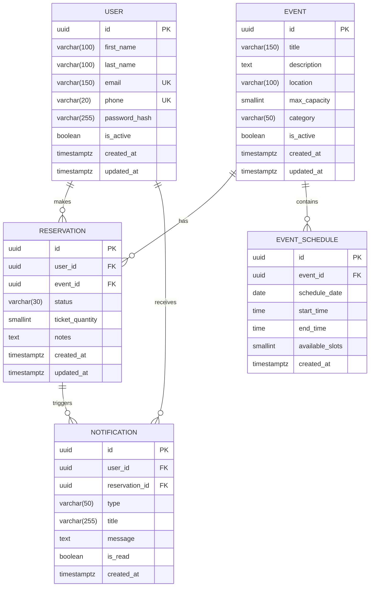

# Domain and Data Model - Event Booking System

## Entity-Relationship Diagram



## Business Rules Matrix

### Capacity and Availability Rules

| Rule ID | Description | Validation |
|---------|-------------|------------|
| BR-001 | Event schedule cannot exceed event max_capacity | `available_slots <= event.max_capacity` |
| BR-002 | Reservation quantity cannot exceed available_slots | `reservation.quantity <= schedule.available_slots` |
| BR-003 | Available slots decrease on confirmed reservation | `schedule.available_slots -= reservation.quantity` |
| BR-004 | Available slots increase on cancellation | `schedule.available_slots += reservation.quantity` |

### Schedule Conflict Rules

| Rule ID | Description | Validation |
|---------|-------------|------------|
| BR-005 | No overlapping schedules for same event | Check time ranges before insert/update |
| BR-006 | End time must be after start time | `end_time > start_time` |
| BR-007 | Schedule date must be in the future | `schedule_date >= CURRENT_DATE` |

### Reservation State Transitions

| Current State | Allowed Transitions | Trigger |
|---------------|---------------------|---------|
| CONFIRMED | CANCELLED | User action |
| CANCELLED | (final state) | - |

### Cancellation Rules

| Rule ID | Description | Action |
|---------|-------------|--------|
| BR-008 | Cancellation restores available slots | Increment schedule.available_slots |
| BR-009 | Only CONFIRMED can be cancelled | Validate status before cancellation |
| BR-010 | Cancellation triggers notification | Create notification for user |

## Naming Conventions

### Tables
- Use plural form: `users`, `events`, `reservations`
- Use snake_case: `event_schedules`, not `eventSchedules`
- Prefix junction tables: `user_event_preferences`

### Columns
- Use snake_case: `first_name`, `last_name`, `created_at`
- Primary keys: `id`
- Foreign keys: `{entity}_id` (e.g., `user_id`, `event_id`)
- Timestamps: `created_at`, `updated_at`
- Boolean flags: `is_active`, `is_read`

### Constraints
- Primary keys: `pk_{table_name}`
- Foreign keys: `fk_{table_name}_{referenced_table}`
- Unique constraints: `uk_{table_name}_{column}`
- Check constraints: `ck_{table_name}_{description}`

### Indexes
- Naming: `idx_{table_name}_{column(s)}`
- Composite: `idx_reservations_user_status`

## Data Type Decisions

### Identifiers
- **UUID** for all public-facing IDs
- Rationale: Prevents enumeration attacks, better for distributed systems

### Text Fields
- `varchar(n)` for bounded strings (names, emails, titles)
- `text` for unbounded content (descriptions, notes)
- Avoid `char(n)` unless fixed-length is required

### Numeric Fields
- `smallint` for capacity, quantity (0-32767 range sufficient)
- `numeric(10,2)` for monetary values (if needed in future)
- Avoid `bigint` unless truly needed (wastes storage)

### Date/Time Fields
- `timestamptz` for audit fields (`created_at`, `updated_at`)
- `date` for schedule dates (no time component needed)
- `time` for start/end times (no date component needed)
- Always use timezone-aware types for audit trails

### Boolean Fields
- `boolean` for flags (`is_active`, `is_read`)
- Default to `false` unless business logic requires `true`

## Indexes Strategy

### High-Frequency Queries
```sql
-- User lookups
CREATE INDEX idx_users_email ON users(email);
CREATE INDEX idx_users_phone ON users(phone);

-- Event searches
CREATE INDEX idx_events_category_active ON events(category, is_active);
CREATE INDEX idx_events_created_at ON events(created_at DESC);

-- Schedule availability
CREATE INDEX idx_event_schedules_event_date ON event_schedules(event_id, schedule_date);
CREATE INDEX idx_event_schedules_date_time ON event_schedules(schedule_date, start_time);

-- Reservation queries
CREATE INDEX idx_reservations_user_status ON reservations(user_id, status);
CREATE INDEX idx_reservations_event_status ON reservations(event_id, status);
CREATE INDEX idx_reservations_created_at ON reservations(created_at DESC);

-- Notification queries
CREATE INDEX idx_notifications_user_read ON notifications(user_id, is_read);
CREATE INDEX idx_notifications_created_at ON notifications(created_at DESC);
```

### Conflict Detection
```sql
-- Check for overlapping schedules
CREATE INDEX idx_event_schedules_overlap_check 
ON event_schedules(event_id, schedule_date, start_time, end_time);
```

## Constraints Definition

### Primary Keys
```sql
ALTER TABLE users ADD CONSTRAINT pk_users PRIMARY KEY (id);
ALTER TABLE events ADD CONSTRAINT pk_events PRIMARY KEY (id);
ALTER TABLE event_schedules ADD CONSTRAINT pk_event_schedules PRIMARY KEY (id);
ALTER TABLE reservations ADD CONSTRAINT pk_reservations PRIMARY KEY (id);
ALTER TABLE notifications ADD CONSTRAINT pk_notifications PRIMARY KEY (id);
```

### Foreign Keys
```sql
ALTER TABLE event_schedules 
    ADD CONSTRAINT fk_event_schedules_events 
    FOREIGN KEY (event_id) REFERENCES events(id) ON DELETE CASCADE;

ALTER TABLE reservations 
    ADD CONSTRAINT fk_reservations_users 
    FOREIGN KEY (user_id) REFERENCES users(id) ON DELETE RESTRICT;

ALTER TABLE reservations 
    ADD CONSTRAINT fk_reservations_events 
    FOREIGN KEY (event_id) REFERENCES events(id) ON DELETE RESTRICT;

ALTER TABLE notifications 
    ADD CONSTRAINT fk_notifications_users 
    FOREIGN KEY (user_id) REFERENCES users(id) ON DELETE CASCADE;

ALTER TABLE notifications 
    ADD CONSTRAINT fk_notifications_reservations 
    FOREIGN KEY (reservation_id) REFERENCES reservations(id) ON DELETE SET NULL;
```

### Unique Constraints
```sql
ALTER TABLE users ADD CONSTRAINT uk_users_email UNIQUE (email);
ALTER TABLE users ADD CONSTRAINT uk_users_phone UNIQUE (phone);
```

### Check Constraints
```sql
ALTER TABLE events 
    ADD CONSTRAINT ck_events_max_capacity 
    CHECK (max_capacity > 0);

ALTER TABLE event_schedules 
    ADD CONSTRAINT ck_event_schedules_time_range 
    CHECK (end_time > start_time);

ALTER TABLE event_schedules 
    ADD CONSTRAINT ck_event_schedules_available_slots 
    CHECK (available_slots >= 0);

ALTER TABLE reservations 
    ADD CONSTRAINT ck_reservations_quantity 
    CHECK (ticket_quantity > 0);

ALTER TABLE reservations 
    ADD CONSTRAINT ck_reservations_status 
    CHECK (status IN ('CONFIRMED', 'CANCELLED'));
```
